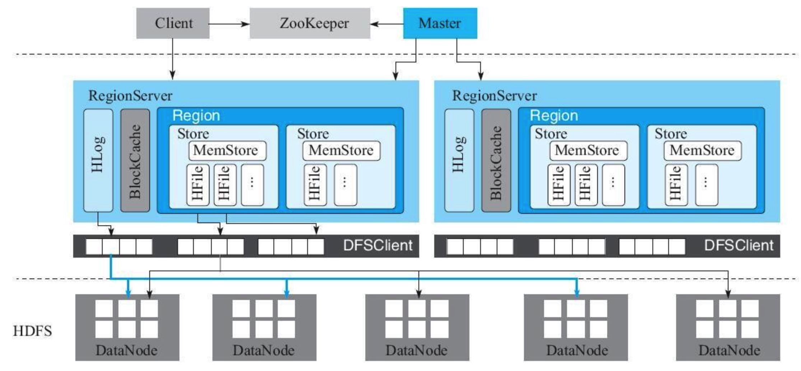

# Hbase 
## 特点
BigTable论文中称BigTable为"sparse，distributed，persistent multidimensional sorted map"。本质上是一个map，具备稀疏、分布式、持久化、多维、有序等特点。map都是有key和value构成
hbase中map的key是有rowkey、column family、qualifier、type、timestamp。value即为cell的值。

+ 稀疏  
  &emsp;空值不占用存储空间
+ 分布式  
  &emsp;集群部署
+ 持久化
+ &emsp;数据最终会持久化到hdfs上  
+ 多维  
  &emsp;key由多个元素构成
+ 有序  
  &emsp;三维有序：rowkey有序；rowkey相同，column family:qulifier有序；column相同，timestamp有序。
+ 列簇存储  
  &emsp;行存：在一行一行检索有优势，但如果查询结果只有其中部分列，会产生大量无效的IO。通常传统的关系型数据库采取行存  
  &emsp;列存：将一列数据存储在一起，常见kudu、parquet都是列存，列存在查询某些列时十分高效。但若获取一行数据，需要多次IO，不适合整行查询。    
  &emsp;列簇存储：hbase采用这种存储方式，可以说是列和行的中间态，列簇能保证在同一列簇的多列可高效检索。但建议实际运用中，列簇不宜设置过多。  
## 架构

## 应用场景
## 参考文献

